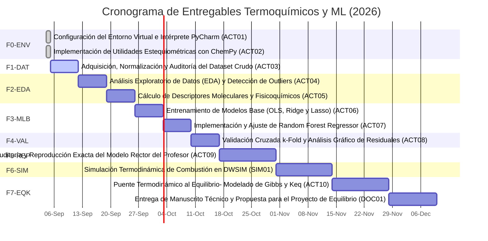

# 🗺️ ROADMAP Y LÍNEA TEMPORAL DE ENTREGABLES
**Proyecto:** Predicción de Entalpías de Combustión Mediante Machine Learning  
**Responsable:** Karol Paola Camacho López  
**Hito Final Crítico:** 10 de Diciembre de 2026 (Inicio Proyecto de Equilibrio Químico)

---

## 📈 Diagrama de Gantt del Proyecto (Mermaid)

---

## 🎯 Resumen de Hitos y Entregables por Fase

| Fase | Actividad | Título del Entregable | Fecha Límite | Estado Actual | Archivo de Cierre |
| :---: | :---: | :--- | :---: | :---: | :--- |
| `F0-ENV` | **ACT01** | Configuración del Entorno Virtual e Intérprete PyCharm | `2026-09-05` | ✅ Completado | `F0-ENV_ACT01_CFG_entorno_pycharm_v1.0_FINAL.txt` |
| `F0-ENV` | **ACT02** | Implementación de Utilidades Estequiométricas con ChemPy | `2026-09-05` | ✅ Completado | `F0-ENV_ACT02_SCR_funciones_chempy_v1.0_FINAL.py` |
| `F1-DAT` | **ACT03** | Adquisición, Normalización y Auditoría del Dataset Crudo | `2026-09-12` | ⏳ En Proceso | `F1-DAT_ACT03_DAT_dataset_curado_v1.0_FINAL.csv` |
| `F2-EDA` | **ACT04** | Análisis Exploratorio de Datos (EDA) y Detección de Outliers | `2026-09-19` | ⛔ Bloqueado | `F2-EDA_ACT04_NBK_exploracion_distribuciones_v1.0_FINAL.ipynb` |
| `F2-EDA` | **ACT05** | Cálculo de Descriptores Moleculares y Fisicoquímicos | `2026-09-26` | ⛔ Bloqueado | `F2-EDA_ACT05_SCR_calculo_descriptores_moleculares_v1.0_FINAL.py` |
| `F3-MLB` | **ACT06** | Entrenamiento de Modelos Base (OLS, Ridge y Lasso) | `2026-10-03` | ⛔ Bloqueado | `F3-MLB_ACT06_NBK_modelos_lineales_baseline_v1.0_FINAL.ipynb` |
| `F3-MLB` | **ACT07** | Implementación y Ajuste de Random Forest Regressor | `2026-10-10` | ⛔ Bloqueado | `F3-MLB_ACT07_SCR_random_forest_regressor_v1.0_FINAL.py` |
| `F4-VAL` | **ACT08** | Validación Cruzada k-Fold y Análisis Gráfico de Residuales | `2026-10-17` | ⛔ Bloqueado | `F4-VAL_ACT08_NBK_diagnostico_residuales_v1.0_FINAL.ipynb` |
| `F5-REP` | **ACT09** | Auditoría y Reproducción Exacta del Modelo Rector del Profesor | `2026-10-31` | ⛔ Bloqueado | `F5-REP_ACT09_REP_informe_reproduccion_modelo_v1.0_FINAL.pdf` |
| `F6-SIM` | **SIM01** | Simulación Termodinámica de Combustión en DWSIM | `2026-11-14` | ⛔ Bloqueado | `F6-SIM_SIM01_SIM_reactor_combustion_dwsim_v1.0_FINAL.dwsim` |
| `F7-EQK` | **ACT10** | Puente Termodinámico al Equilibrio: Modelado de Gibbs y Keq | `2026-11-28` | ⛔ Bloqueado | `F7-EQK_ACT10_SCR_calculador_gibbs_keq_v1.0_FINAL.py` |
| `F7-EQK` | **DOC01** | Entrega de Manuscrito Técnico y Propuesta para el Proyecto de Equilibrio | `2026-12-10` | ⛔ Bloqueado | `F7-EQK_DOC01_REP_manuscrito_final_propuesta_v1.0_FINAL.pdf` |
